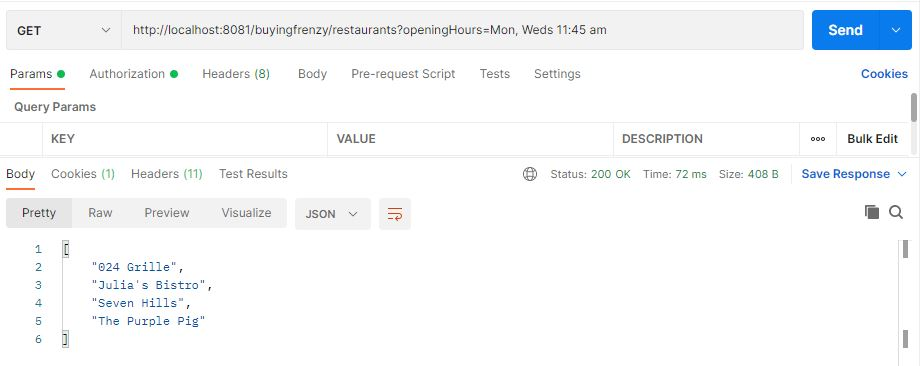
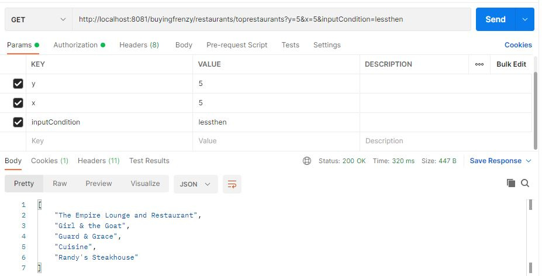
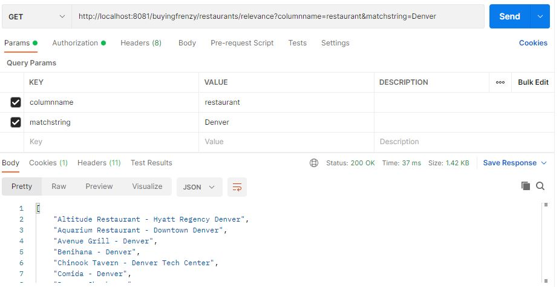
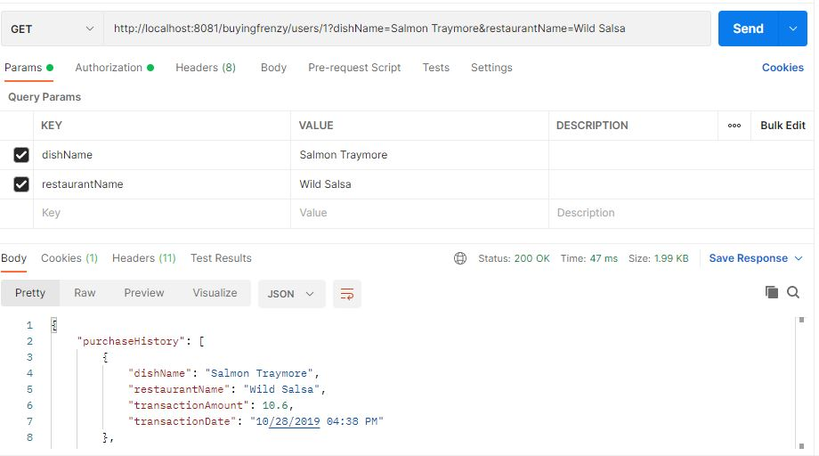

# poonam-sawant-web-software-engineer-19Jan2022
Glints Interview Assignment - Buying Frenzy

---
### Table of Contents
- [Description](#description)
- [How To Build](#how-to-build)
- [How To Deploy](#how-to-deploy)
- [How To Run](#how-to-run)
- [Web Service Documentation](#web-service-documentation)
- [Important Notes](#important-notes)
- [About the Service](#about-the-Service)

## Description

Access Requirement for this API https://gist.github.com/seahyc/97b154ce5bfd4f2b6e3a3a99a7b93f69 

This project is build in Java ( version 8 ) / Spring boot ( version 2.5.2 ) / Gradle. The Application is package as a jar file using embedded tomcat.

* RESTful Web services is created with Spring MVC ( org.springframework.boot:spring-boot-starter-web ).
* In Memory Databse integration is done using JPA api ( com.h2database:h2 / org.springframework.boot:spring-boot-starter-data-jpa ).
* Web Security is achieved using Spring Security ( org.springframework.boot:spring-boot-starter-security ).
* Testing is done using JUnit 1.8.2 and Spring boot Test api ( org.springframework.boot:spring-boot-starter-test ).
* REST Documentation is done using REST docs ans AsciiDocs ( org.springframework.restdocs:spring-restdocs-asciidoctor / org.springframework.restdocs:spring-restdocs-mockmvc ).
* Docker image generation is done with com.palantir.docker.

## How To Build

One of the way to run this project to build using gradle command

```shell
gradle clean build
```

## How To Deploy

There are two way to do deploy the application
* Create Docker image locally
	
```shell
gradle clean build docker
```
	
* Pull image from Dockerhub
	
```shell
docker pull ?
```

## How To Run

There are two way to do deploy the application
* Can run directly with java pre installed
	
```shell
gradle clean build
java -jar ./build/libs/buyingfrenzy-0.0.1-SNAPSHOT.jar
```
	
* Run docker image. for this approach, need to have docker install in local
	
```shell
docker run --ip localhost -p 8000:8000 ?/buyingfrenzy-0.0.1-SNAPSHOT
```

## Web Service Documentation

Documentation for this application is available at folder ./build/generated-docs/index.html
Also, this can be generated by below command

```shell
gradle clean build asciidoctor
```

## Important Notes

* Data from sample provided restaurant_with_menu.json and users_with_purchase_history.json will be saved to H2 DB on server start. 

json file path - src/main/resources/json

* H2 DB Creds

console url: http://localhost:8081/h2-console/

JDBC URL: jdbc:h2:mem:buyingfrenzy

username: sa

password: password

* Web Security Creds

username: username

password: password

* Basic Auth

Basic dXNlcm5hbWU6cGFzc3dvcmQ=

## About the Service

ProblemStatement 1: List all restaurants that are open at a certain datetime

Sample Link - http://localhost:8081/buyingfrenzy/restaurants?openingHours=Mon, Weds 11:45 am

[](/images/getRestaurantsByOpeningHrs.JPEG)

ProblemStatement 2: List top y restaurants that have more or less than x number of dishes within a price range

Sample Link - http://localhost:8081/buyingfrenzy/restaurants/toprestaurants?y=5&x=5&inputCondition=lessthen

[](images/getRestaurantsByParam.JPEG)

ProblemStatement 3: Search for restaurants or dishes by name, ranked by relevance to search term

Sample Link - http://localhost:8081/buyingfrenzy/restaurants/relevance?columnname=restaurant&matchstring=Denver

[](images/getRestaurantsByRelevance.JPEG)

Sample Link - http://localhost:8081/buyingfrenzy/restaurants/relevance?columnname=dish&matchstring=Sardines

[](images/getDishByRelevance.JPEG)

ProblemStatement 4: Process a user purchasing a dish from a restaurant, handling all relevant data changes in an atomic transaction

Sample Link - http://localhost:8081/buyingfrenzy/users/1?dishName=Salmon Traymore&restaurantName=Wild Salsa

[](images/updateBuyDishTransaction.JPEG)
